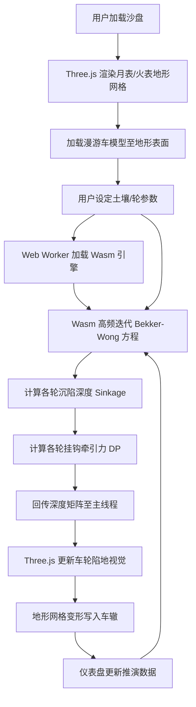

## 1. 产品概述

异星漫游车地面力学推演沙盘是一款面向深空探测任务论证的实时三维物理仿真系统。系统基于 Bekker-Wong 非线性地面力学理论，对漫游车在月表/火表松软风化层上的沉陷与牵引行为进行高保真推演，为探测器轮式底盘设计提供量化依据。

- 目标用户：深空探测任务论证工程师、行星地面力学研究者、航天器轮底盘设计人员
- 核心价值：将传统离线地面力学计算提升为实时交互式三维推演，显著加速轮-土耦合设计迭代

## 2. 核心功能

### 2.1 功能模块

1. **三维地形沙盘页**：月表/火表风化层三维网格、漫游车模型、车辙印痕、参数控制面板、推演数据仪表盘
2. **参数配置面板**：土壤参数、轮参数、任务场景切换

### 2.2 页面详情

| 页面名称 | 模块名称 | 功能描述 |
|----------|----------|----------|
| 三维地形沙盘页 | 风化层地形网格 | 首屏加载崎岖月表/火表三维地形，支持鼠标旋转/缩放/平移 |
| 三维地形沙盘页 | 漫游车模型 | 六轮漫游车模型，含网状轮结构可视化 |
| 三维地形沙盘页 | 地面力学推演引擎 | Wasm 端高频迭代 Bekker-Wong 方程组，实时计算沉陷深度与挂钩牵引力 |
| 三维地形沙盘页 | 沉陷视觉反馈 | 根据回传深度矩阵，车轮产生真实陷地视觉表现 |
| 三维地形沙盘页 | 动态车辙印痕 | 碾压过的网格表面留下不可逆三维车辙 |
| 三维地形沙盘页 | 推演数据仪表盘 | 实时显示各轮沉陷深度、挂钩牵引力、滑转率等关键指标 |
| 参数配置面板 | 土壤参数调节 | 内摩擦角 φ、内聚力 c、沉陷模量 k_c/k_φ、剪切模量 K、密度 ρ |
| 参数配置面板 | 轮参数调节 | 轮径、轮宽、网状轮开孔率、轮齿参数、垂直载荷 |
| 参数配置面板 | 场景切换 | 月表场景 / 火表场景预设切换 |

## 3. 核心流程

用户打开沙盘后，系统自动加载三维月表地形与漫游车模型。用户通过参数面板调节土壤与轮参数，Wasm 推演引擎在 Web Worker 中以 60fps+ 频率迭代 Bekker-Wong 方程组，实时将沉陷深度矩阵回传主线程。Three.js 渲染层根据深度矩阵驱动车轮陷地动画与地形网格变形，形成不可逆车辙。用户可随时拖拽漫游车观察不同路径下的沉陷行为。

## 4. 用户界面设计

### 4.1 设计风格

- 主色调：深空黑 (#0a0e17) + 月壤灰 (#8b8680) + 火壤赭 (#c45a2c) 作为场景切换色
- 强调色：科技青 (#00e5ff)，用于数据高亮与交互反馈
- 按钮风格：圆角矩形，微光边框，hover 发光效果
- 字体：Orbitron（显示字体，标题/数据）+ Source Sans 3（正文字体）
- 布局：全屏 3D 视口 + 左侧浮动参数面板 + 右侧浮动数据仪表盘
- 图标：lucide-react 线性图标

### 4.2 页面设计概览

| 页面名称 | 模块名称 | UI 元素 |
|----------|----------|---------|
| 三维地形沙盘页 | 三维视口 | 全屏 Three.js Canvas，深空星场背景，环境光+方向光 |
| 三维地形沙盘页 | 参数面板 | 左侧半透明毛玻璃面板，滑块+数值输入，场景切换按钮 |
| 三维地形沙盘页 | 数据仪表盘 | 右侧半透明毛玻璃面板，实时折线图+数值卡片 |
| 三维地形沙盘页 | 漫游车操控 | 底部 WASD/方向键提示，拖拽交互 |

### 4.3 响应式

- 桌面优先设计，3D 视口全屏自适应
- 参数面板可折叠，小屏默认收起
- 触屏支持：双指缩放、单指旋转、双指平移

### 4.4 3D 场景指引

- 环境：深空黑色背景 + 星场粒子系统，月球场景偏冷灰调，火星场景偏暖赭调
- 灯光：主方向光模拟太阳光（平行光+软阴影），环境光模拟散射（低强度半球光）
- 相机：透视相机，初始斜 45° 俯视，OrbitControls 自由旋转，可跟随漫游车
- 焦点元素：漫游车模型+车轮沉陷效果+车辙印痕
- 交互：OrbitControls 旋转/缩放/平移，漫游车 WASD 移动
- 后处理：可选 Bloom 效果增强科技感
- 性能预算：地形网格 ≤ 128×128 顶点，目标 60fps
