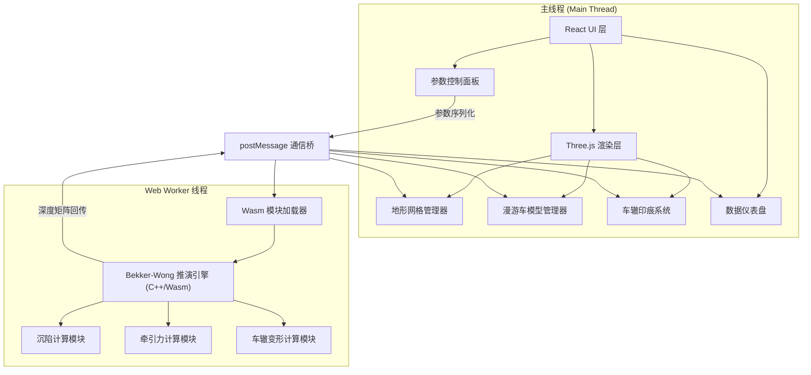

## 1. 架构设计



## 2. 技术说明

- 前端框架：React 18 + TypeScript + Vite
- 3D 渲染：Three.js + @react-three/fiber + @react-three/drei
- 状态管理：Zustand
- 物理引擎：C++ 编写，Emscripten 编译为 WebAssembly，运行于 Web Worker
- 通信机制：主线程 ↔ Web Worker 通过 postMessage + Transferable Objects（Float32Array）
- 样式：Tailwind CSS + CSS Variables
- 初始化工具：vite-init (react-ts 模板)

## 3. 路由定义

| 路由 | 用途 |
|------|------|
| / | 主沙盘页面，包含三维视口、参数面板、仪表盘 |

## 4. C++ / WebAssembly 推演引擎设计

### 4.1 核心 API

```typescript
interface TerramechanicsWasm {
  init(terrainWidth: number, terrainHeight: number, resolution: number): void;
  setSoilParams(params: SoilParams): void;
  setWheelParams(wheelIndex: number, params: WheelParams): void;
  updateRoverPosition(x: number, z: number, heading: number): void;
  step(dt: number): StepResult;
  getSinkageMatrix(): Float32Array;
  getRutBuffer(): Float32Array;
  getWheelForces(): Float32Array;
  reset(): void;
}

interface SoilParams {
  phi: number;      // 内摩擦角 (rad)
  c: number;        // 内聚力 (Pa)
  k_c: number;      // 内聚沉陷模量
  k_phi: number;    // 摩擦沉陷模量
  K: number;        // 剪切变形模量 (m)
  rho: number;      // 土壤密度 (kg/m³)
  n: number;        // 沉陷指数
}

interface WheelParams {
  radius: number;   // 轮半径 (m)
  width: number;    // 轮宽 (m)
  openRatio: number;// 网状轮开孔率
  load: number;     // 垂直载荷 (N)
}

interface StepResult {
  sinkage: number[];       // 各轮沉陷深度
  drawbarPull: number[];   // 各轮挂钩牵引力
  slipRatio: number[];     // 各轮滑转率
  motionResistance: number[]; // 各轮滚动阻力
}
```

### 4.2 Bekker-Wong 方程组

**沉陷压力关系（Bekker 方程）：**
```
p = (k_c / b + k_phi) * z^n
```
- p: 接触压力 (Pa)
- b: 轮宽 (m)
- z: 沉陷深度 (m)
- n, k_c, k_phi: Bekker 沉陷参数

**沉陷深度求解：**
```
z = [W / (b * L * (k_c / b + k_phi))]^(1/n)
```
- W: 轮上垂直载荷 (N)
- L: 接触长度 (m)，由沉陷角推导

**剪切应力-位移关系（Janosi-Hanamoto）：**
```
τ = (c + p * tan(φ)) * (1 - e^(-j/K))
```
- τ: 剪切应力 (Pa)
- j: 剪切位移 (m)
- K: 剪切变形模量 (m)

**挂钩牵引力：**
```
DP = τ * A_contact - R_motion
```
- A_contact: 接触面积
- R_motion: 运动阻力（压实阻力+推土阻力）

## 5. 数据流设计

### 5.1 初始化流程

1. 主线程创建 Three.js 场景、地形网格、漫游车模型
2. 主线程创建 Web Worker，加载 Wasm 模块
3. Wasm 端调用 `init()` 初始化地形网格数据
4. 主线程同步地形高度数据至 Wasm 端

### 5.2 实时推演循环

```
每帧 (requestAnimationFrame):
  1. 主线程收集用户输入（WASD/参数变更）
  2. 通过 postMessage 发送输入至 Worker
  3. Worker 内 Wasm 执行 step(dt)
  4. Wasm 返回沉陷矩阵 + 力数据
  5. 主线程更新车轮位置（沉陷偏移）
  6. 主线程更新地形顶点（车辙变形）
  7. 主线程更新仪表盘数据
  8. Three.js 渲染
```

### 5.3 车辙印痕系统

- 地形网格使用 BufferGeometry，顶点位置属性可动态修改
- Wasm 端维护一份与地形网格对齐的变形缓冲区
- 每帧将变形缓冲区回传主线程，写入 geometry.attributes.position
- 变形为不可逆：已变形顶点高度只减不增
- 车辙宽度由轮宽决定，深度由沉陷深度决定

## 6. 项目目录结构

```
src/
├── components/
│   ├── Scene.tsx              # Three.js 主场景
│   ├── Terrain.tsx            # 风化层地形网格
│   ├── Rover.tsx              # 漫游车模型
│   ├── WheelMesh.tsx          # 网状轮可视化
│   ├── RutSystem.tsx          # 车辙印痕管理
│   ├── ControlPanel.tsx       # 参数控制面板
│   ├── Dashboard.tsx          # 推演数据仪表盘
│   └── StarField.tsx          # 星场背景
├── hooks/
│   ├── useWasmWorker.ts       # Wasm Worker 通信 hook
│   ├── useRoverControls.ts    # 漫游车操控 hook
│   └── useSimulationLoop.ts   # 推演循环 hook
├── store/
│   └── simulationStore.ts     # Zustand 全局状态
├── workers/
│   └── terramechanics.worker.ts  # Web Worker 入口
├── wasm/
│   ├── terramechanics.cpp     # C++ 源码
│   └── terramechanics.wasm    # 编译产物
├── utils/
│   ├── terrainGenerator.ts    # 地形生成工具
│   └── soilPresets.ts         # 土壤预设数据
├── App.tsx
├── main.tsx
└── index.css
```
